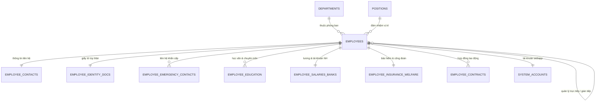

# TÀI LIỆU CƠ SỞ DỮ LIỆU NHÂN SỰ CHUẨN HÓA (HRM DATABASE SCHEMA)

Tài liệu hướng dẫn cấu trúc bảng, khóa liên kết (ERD) và từ điển dữ liệu cho WebApp Quản trị Nhân sự (HRM).

---

## 1. TỔNG QUAN HỆ THỐNG CSDL

- **Số lượng bảng/sheet:** 11 bảng dữ liệu quan hệ + 1 sheet Từ điển dữ liệu.
- **Tổng số nhân sự quản lý:** 852 nhân viên.
- **Tổng số đơn vị/phòng ban:** 28 đơn vị.
- **Tổng số chức danh/vị trí:** 113 chức danh.
- **Mức độ chuẩn hóa:** Chuẩn 3NF (Third Normal Form), loại bỏ hoàn toàn trùng lặp dữ liệu, tích hợp khóa ngoại tự tham chiếu cấp quản lý.

---

## 2. SƠ ĐỒ MỐI QUAN HỆ THỰC THỂ (ERD)



---

## 3. DANH SÁCH 11 BẢNG & SHEET CHI TIẾT

| STT | Sheet Name trong Excel | Tên Bảng SQL | Khóa Chính (PK) | Khóa Ngoại (FK) | Số bản ghi | Mô tả chức năng |
|:---:|:---|:---|:---|:---|:---:|:---|
| 0 | `00_Data_Dictionary` | `data_dictionary` | - | - | 25 | Bảng tra cứu từ điển dữ liệu & schema |
| 1 | `01_Departments` | `departments` | `department_id` | - | 28 | Danh mục cơ cấu tổ chức & phòng ban |
| 2 | `02_Positions` | `positions` | `position_id` | - | 113 | Danh mục chức danh & vị trí công việc |
| 3 | `03_Employees` | `employees` | `employee_id` | `department_id`, `position_id`, `direct_manager_id`, `indirect_manager_id` | 852 | **Bảng trung tâm** lưu thông tin nhân sự |
| 4 | `04_Contacts_Addresses` | `employee_contacts` | `employee_id` | `employee_id` | 852 | SĐT, Email, Địa chỉ thường trú & tạm trú |
| 5 | `05_Identity_Docs` | `employee_identity_docs` | `employee_id` | `employee_id` | 852 | CCCD, CMND, Hộ chiếu, Ngày cấp & Nơi cấp |
| 6 | `06_Emergency_Contacts` | `employee_emergency_contacts` | `id` | `employee_id` | 572 | Thông tin người thân liên hệ khẩn cấp |
| 7 | `07_Education` | `employee_education` | `id` | `employee_id` | 525 | Trình độ đào tạo, Trường, Ngành học |
| 8 | `08_Salaries_Banks` | `employee_salaries_banks` | `employee_id` | `employee_id` | 852 | Lương cơ bản, Tổng lương, STK & Ngân hàng |
| 9 | `09_Insurance_Welfare` | `employee_insurance_welfare` | `employee_id` | `employee_id` | 852 | Sổ BHXH, Mã BHXH, Tỷ lệ đóng, Nơi KCB |
| 10 | `10_Contracts` | `employee_contracts` | `contract_id` | `employee_id` | 847 | Hợp đồng lao động, Ngày bắt đầu, Hiệu lực |
| 11 | `11_System_Accounts` | `system_accounts` | `account_id` | `employee_id` | 852 | Tài khoản đăng nhập WebApp & Phân quyền RBAC |

---

## 4. HƯỚNG DẪN TRUY VẤN MẪU CHO WEBAPP HRM

### 4.1. Lấy thông tin chi tiết nhân viên cùng phòng ban, vị trí và quản lý trực tiếp
```sql
SELECT 
    e.employee_id,
    e.full_name,
    e.gender,
    e.date_of_birth,
    d.department_name,
    p.position_name,
    m.full_name AS direct_manager_name,
    c.mobile_phone,
    c.work_email,
    s.base_salary,
    s.bank_account_number,
    s.bank_name
FROM employees e
LEFT JOIN departments d ON e.department_id = d.department_id
LEFT JOIN positions p ON e.position_id = p.position_id
LEFT JOIN employees m ON e.direct_manager_id = m.employee_id
LEFT JOIN employee_contacts c ON e.employee_id = c.employee_id
LEFT JOIN employee_salaries_banks s ON e.employee_id = s.employee_id
WHERE e.employment_status = 'Đang làm việc';
```

### 4.2. Thống kê nhân sự theo phòng ban
```sql
SELECT 
    d.department_name,
    COUNT(e.employee_id) AS total_employees,
    SUM(CASE WHEN e.employment_status = 'Đang làm việc' THEN 1 ELSE 0 END) AS active_employees,
    SUM(CASE WHEN e.gender = 'Nam' THEN 1 ELSE 0 END) AS male_count,
    SUM(CASE WHEN e.gender = 'Nữ' THEN 1 ELSE 0 END) AS female_count,
    AVG(s.base_salary) AS avg_base_salary
FROM departments d
LEFT JOIN employees e ON d.department_id = e.department_id
LEFT JOIN employee_salaries_banks s ON e.employee_id = s.employee_id
GROUP BY d.department_id, d.department_name
ORDER BY total_employees DESC;
```

---

## 5. DANH SÁCH FILE ARTIFACTS ĐÃ TẠO

1. **`HRM_Database_Normalized.xlsx`**: File Excel 12 sheets hoàn chỉnh, định dạng chuẩn màu sắc, tự động căn chỉnh và cố định tiêu đề.
2. **`schema_postgres.sql`**: Script DDL hoàn chỉnh cho PostgreSQL / Supabase.
3. **`schema_mysql.sql`**: Script DDL cho MySQL / MariaDB.
4. **`seed_data.sql`**: Script INSERT toàn bộ 852 nhân sự vào CSDL quan hệ.
5. **`database_schema.json`**: Trích xuất dữ liệu dạng JSON cho API / Frontend.
