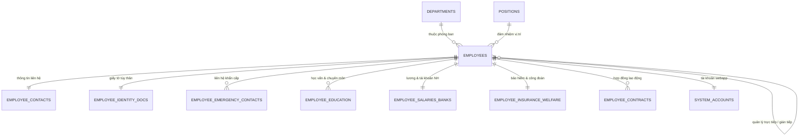

# TÀI LIỆU CƠ SỞ DỮ LIỆU NHÂN SỰ CHUẨN HÓA (HRM DATABASE SCHEMA)

Tài liệu hướng dẫn cấu trúc bảng, khóa liên kết (ERD) và từ điển dữ liệu cho WebApp Quản trị Nhân sự (HRM).

---

## 1. TỔNG QUAN HỆ THỐNG CSDL

- **Số lượng bảng/sheet:** 11 bảng dữ liệu quan hệ + 1 sheet Từ điển dữ liệu.
- **Tổng số nhân sự quản lý:** 1,000 nhân viên (TH-1001 đến TH-2000).
- **Tổng số đơn vị/phòng ban:** 28 đơn vị.
- **Tổng số chức danh/vị trí:** 113 chức danh.
- **Mức độ chuẩn hóa:** Chuẩn 3NF (Third Normal Form), loại bỏ hoàn toàn trùng lặp dữ liệu, tích hợp khóa ngoại tự tham chiếu cấp quản lý.

---

## 2. SƠ ĐỒ MỐI QUAN HỆ THỰC THỂ (ERD)



---

## 3. DANH SÁCH 11 BẢNG & SHEET CHI TIẾT

| STT | Sheet Name trong Excel | Tên Bảng SQL | Khóa Chính (PK) | Khóa Ngoại (FK) | Số bản ghi | Mô tả chức năng |
|:---:|:---|:---|:---|:---|:---:|:---|
| 0 | `00_Master_Profiles` | `master_profiles` | `employee_id` | - | 1,000 | **Bảng tổng hợp 34 cột trường đầy đủ** phục vụ tra cứu & xuất báo cáo |
| 0b| `00_Data_Dictionary` | `data_dictionary` | - | - | 38 | Bảng tra cứu từ điển dữ liệu & schema |
| 1 | `01_Departments` | `departments` | `department_id` | - | 28 | Danh mục cơ cấu tổ chức & phòng ban |
| 2 | `02_Positions` | `positions` | `position_id` | - | 113 | Danh mục chức danh & vị trí công việc |
| 3 | `03_Employees` | `employees` | `employee_id` | `department_id`, `position_id`, `direct_manager_id`, `indirect_manager_id` | 1,000 | **Bảng trung tâm** lưu thông tin nhân sự |
| 4 | `04_Contacts_Addresses` | `employee_contacts` | `employee_id` | `employee_id` | 1,000 | SĐT, Email, Địa chỉ thường trú & tạm trú |
| 5 | `05_Identity_Docs` | `employee_identity_docs` | `employee_id` | `employee_id` | 1,000 | CCCD, CMND, Hộ chiếu, Ngày cấp & Nơi cấp |
| 6 | `06_Emergency_Contacts` | `employee_emergency_contacts` | `id` | `employee_id` | 1,000 | Thông tin người thân liên hệ khẩn cấp |
| 7 | `07_Education` | `employee_education` | `id` | `employee_id` | 1,000 | Trình độ đào tạo, Trường, Ngành học, Chứng chỉ |
| 8 | `08_Salaries_Banks` | `employee_salaries_banks` | `employee_id` | `employee_id` | 1,000 | Lương cơ bản, Tổng lương, STK & Ngân hàng |
| 9 | `09_Insurance_Welfare` | `employee_insurance_welfare` | `employee_id` | `employee_id` | 1,000 | Sổ BHXH, Mã BHXH, Tỷ lệ đóng, Nơi KCB |
| 10 | `10_Contracts` | `employee_contracts` | `contract_id` | `employee_id` | 1,000 | Hợp đồng lao động, Ngày bắt đầu, Hiệu lực |
| 11 | `11_System_Accounts` | `system_accounts` | `account_id` | `employee_id` | 359 | Tài khoản đăng nhập WebApp & Phân quyền RBAC |

---

## 3.1. DANH MỤC 34 CỘT TRƯỜNG THÔNG TIN HỒ SƠ NHÂN VIÊN

1. `Mã nhân viên`: Mã định danh duy nhất (VD: `TH-1001`, `TH-1948`...)
2. `Họ và tên`: Họ tên đầy đủ tiếng Việt có dấu
3. `Ngày bắt đầu làm việc`: Ngày gia nhập / bắt đầu làm việc tại công ty
4. `Ngày kết thúc`: Ngày kết thúc hợp đồng xác định thời hạn hoặc ngày nghỉ việc
5. `Loại hợp đồng`: Hợp đồng thử việc, HĐLĐ không xác định thời hạn, HĐLĐ 36 tháng
6. `Phòng/Ban`: Đơn vị công tác, ban điều hành dự án hoặc phòng nghiệp vụ
7. `Cấp bậc`: Cấp bậc nhân sự (Cấp 1 đến Cấp 10 từ Nhân viên, Chuyên viên đến Ban Lãnh đạo)
8. `Chức danh`: Chức danh công việc chuyên môn cụ thể
9. `Điện thoại`: Số điện thoại di động chính thức
10. `Email`: Email công vụ `@trunghaico.vn` và Email cá nhân
11. `Địa điểm làm việc`: Trụ sở Tổng công ty hoặc Ban Điều hành dự án công trình
12. `Ngày tháng năm sinh`: Ngày sinh chuẩn ISO (YYYY-MM-DD)
13. `Giới tính`: Nam / Nữ
14. `Nơi sinh`: Tỉnh/Thành phố nơi sinh
15. `Tình trạng hôn nhân`: Độc thân, Đã có gia đình, Ly hôn
16. `Số con`: Số lượng con (0, 1, 2, 3...)
17. `Nguyên quán`: Tỉnh/Thành phố quê quán
18. `Dân tộc`: Dân tộc (Kinh, Tày, Mường, Thái, Hoa...)
19. `Tôn giáo`: Không, Phật giáo, Công giáo...
20. `Số CCCD/Hộ chiếu`: Số Căn cước công dân 12 chữ số / Số Hộ chiếu
21. `Ngày cấp`: Ngày cấp CCCD/Hộ chiếu
22. `Nơi cấp`: Cục Cảnh sát QLHC về TTXH / Bộ Công An
23. `Địa chỉ thường trú`: Địa chỉ hộ khẩu thường trú 4 cấp đầy đủ
24. `Địa chỉ tạm trú`: Chỗ ở hiện nay 4 cấp đầy đủ
25. `Số sổ BHXH`: Mã số và số sổ Bảo hiểm xã hội 10 chữ số
26. `Nơi đăng ký khám, chữa bệnh ban đầu`: Bệnh viện đăng ký KCB ban đầu
27. `Mã số thuế cá nhân`: Mã số thuế TNCN 10 chữ số
28. `Số tài khoản`: Số tài khoản ngân hàng nhận lương
29. `Tên ngân hàng`: Vietcombank, BIDV, VietinBank, Techcombank, MB, ACB, Agribank
30. `Tên chi nhánh/Phòng Giao dịch`: Chi nhánh ngân hàng mở tài khoản
31. `Trình độ học vấn`: Đại học, Thạc sĩ, Tiến sĩ, Cao đẳng, Trung cấp
32. `Trình độ chuyên môn: Chuyên ngành học`: Ngành đào tạo chính quy
33. `Bằng cấp chuyên môn khác`: Chứng chỉ giám sát, QLDA PMP, chỉ huy trưởng, an toàn LĐ...
34. `Liên lạc khẩn cấp (họ tên, mối quan hệ, số điện thoại)`: Thông tin liên hệ người thân khi khẩn cấp

---

## 4. HƯỚNG DẪN TRUY VẤN MẪU CHO WEBAPP HRM

### 4.1. Lấy thông tin chi tiết nhân viên cùng phòng ban, vị trí và quản lý trực tiếp
```sql
SELECT 
    e.employee_id,
    e.full_name,
    e.gender,
    e.date_of_birth,
    d.department_name,
    p.position_name,
    m.full_name AS direct_manager_name,
    c.mobile_phone,
    c.work_email,
    s.base_salary,
    s.bank_account_number,
    s.bank_name
FROM employees e
LEFT JOIN departments d ON e.department_id = d.department_id
LEFT JOIN positions p ON e.position_id = p.position_id
LEFT JOIN employees m ON e.direct_manager_id = m.employee_id
LEFT JOIN employee_contacts c ON e.employee_id = c.employee_id
LEFT JOIN employee_salaries_banks s ON e.employee_id = s.employee_id
WHERE e.employment_status = 'Đang làm việc';
```

### 4.2. Thống kê nhân sự theo phòng ban
```sql
SELECT 
    d.department_name,
    COUNT(e.employee_id) AS total_employees,
    SUM(CASE WHEN e.employment_status = 'Đang làm việc' THEN 1 ELSE 0 END) AS active_employees,
    SUM(CASE WHEN e.gender = 'Nam' THEN 1 ELSE 0 END) AS male_count,
    SUM(CASE WHEN e.gender = 'Nữ' THEN 1 ELSE 0 END) AS female_count,
    AVG(s.base_salary) AS avg_base_salary
FROM departments d
LEFT JOIN employees e ON d.department_id = e.department_id
LEFT JOIN employee_salaries_banks s ON e.employee_id = s.employee_id
GROUP BY d.department_id, d.department_name
ORDER BY total_employees DESC;
```

---

## 5. DANH SÁCH FILE ARTIFACTS ĐÃ TẠO

1. **`HRM_Database_Normalized.xlsx`**: File Excel 12 sheets hoàn chỉnh, định dạng chuẩn màu sắc, tự động căn chỉnh và cố định tiêu đề.
2. **`schema_postgres.sql`**: Script DDL hoàn chỉnh cho PostgreSQL / Supabase.
3. **`schema_mysql.sql`**: Script DDL cho MySQL / MariaDB.
4. **`seed_data.sql`**: Script INSERT toàn bộ 852 nhân sự vào CSDL quan hệ.
5. **`database_schema.json`**: Trích xuất dữ liệu dạng JSON cho API / Frontend.
